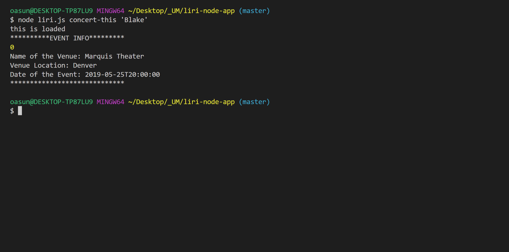
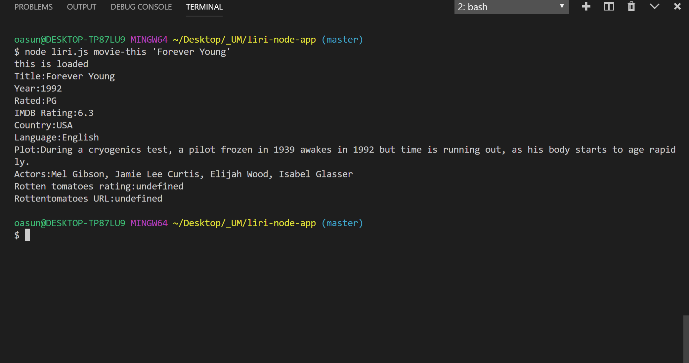

## ABOUT THE APP

LIRI is a Language Interpretation and Recognition Interface, it's just like SIRI(Speech Interpretation and Recognition Interface).LIRI is a node.js command line that gathers information(parameters) and returns back data.In this application, user has the option to use the command lines listed below;

* concert-this
* spotify-this-song
* movie-this
* do-what-it-says

## HOW LIRI WORKS

### Step by Step instructions

* First, navigate the LIRI node app folder and open the file liri.js.

* Second, open liri.js in the bash terminal.

* Third, on the command line enter the command you want to use.

* Example: Run  "concert-this" command

       $ node _liri.js_  concert-this <name of artist or band>

       Output: The system will display "List of Events": 'Name of the Venue','Venue Location' and 'Date of the Event'.

 

* Example: Run  "spotify-this-song" command

    $ node _liri.js_ spotify-this-song <name of song>

       Output: The system will display : Artist(s),The song's name, A preview link of the song from Spotify,and The album that the song is from. 

 
        
      
* Example: Run  "movie-this" command

    $ node _liri.js_ movie-this <name of movie>

        Output: The system will display information associated with the movie such as;

       * Title of the movie.

       * Year the movie came out.

       * IMDB Rating of the movie.

       * Rotten Tomatoes Rating of the movie.

       * Country where the movie was produced.

       * Language of the movie.

       * Plot of the movie.

       * Actors in the movie.

 

* Example: Run "do-what-it-says" command

  $ node _liri.js_ do-what-it-says

  Output:  Using the `fs` Node package, LIRI will take the text inside of random.txt and then use it to call one of LIRI's commands.

     * It should run `spotify-this-song` for "I Want it That Way," as follows the text in `random.txt`.

 
    
## TECHNOLOGIES USED

* Node.js
* Javascript
* Node packages
    - File System(fs)
    - Request
    - Moment
    - Dotenv
    - Axios
    - Node-spotify-API
* API used
    - Bands in Town
    - OMDB
* GitHub   

*References: Youtube videos, GitHub repositories and UM Coding Boot Camp instructions*

